# Mountain Valley Website

Application built with Next.js and Supabase.

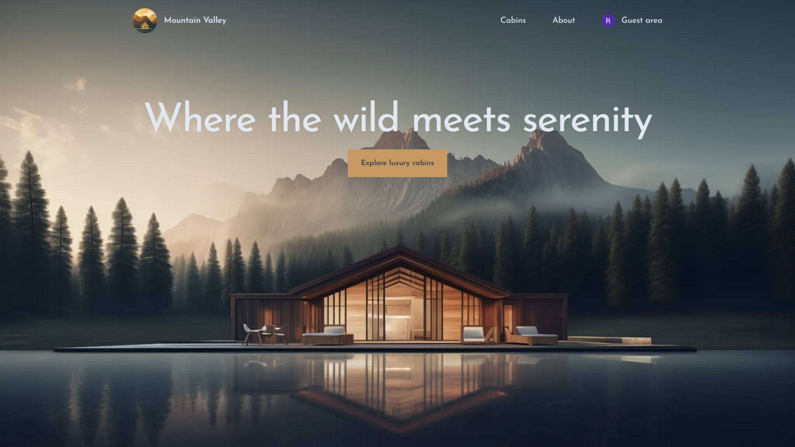
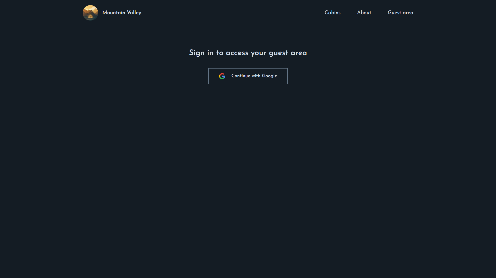
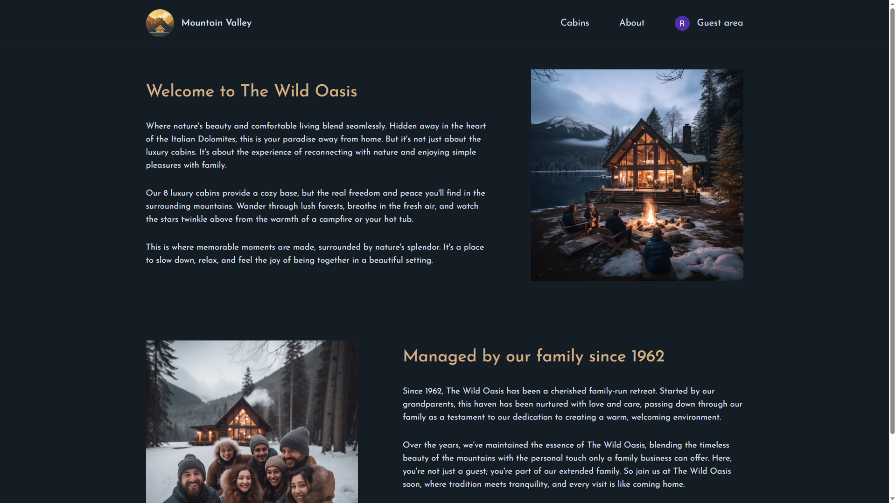
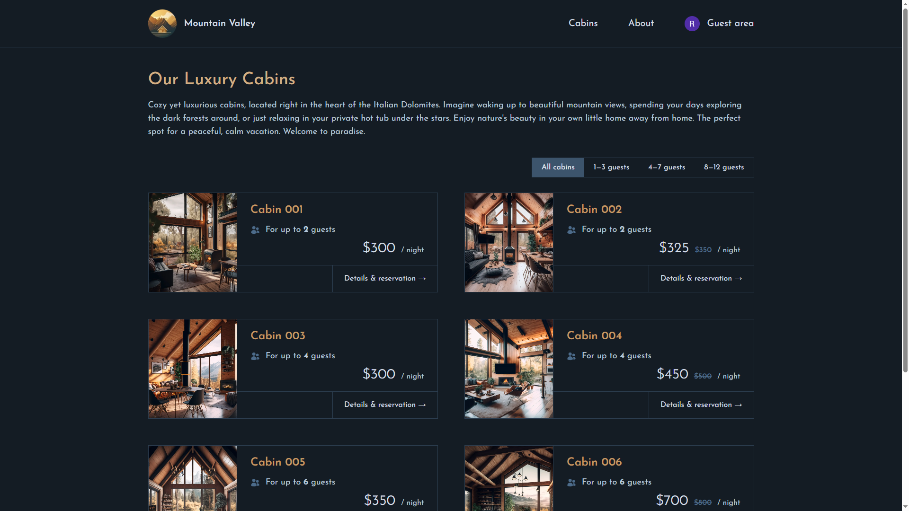
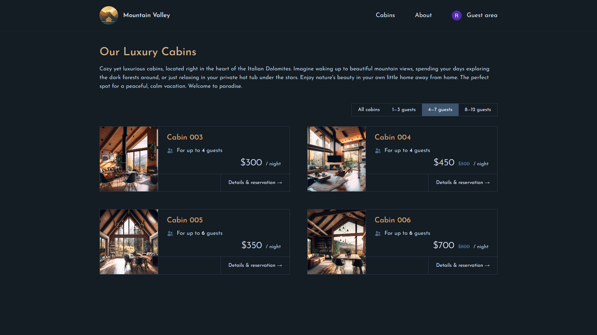
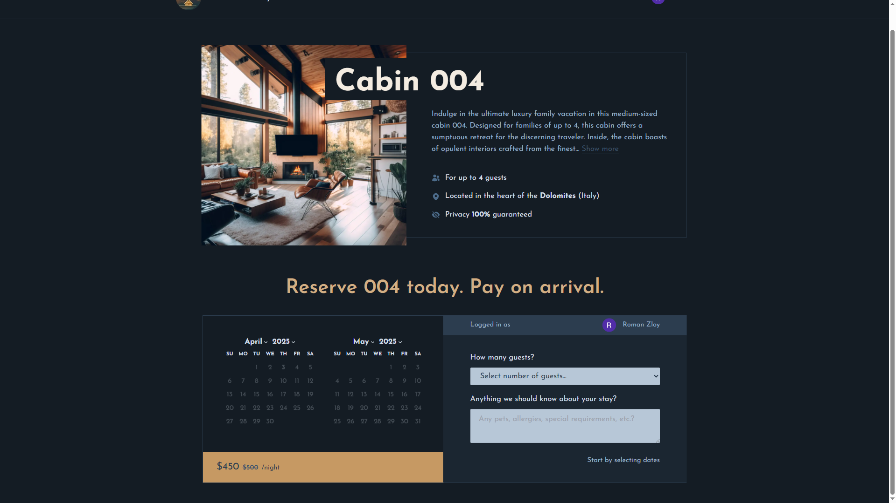
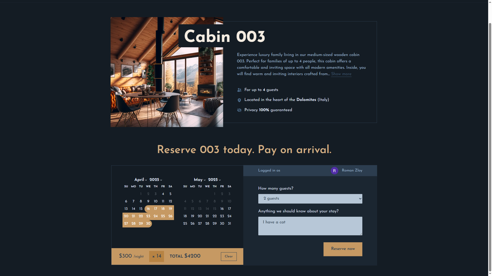
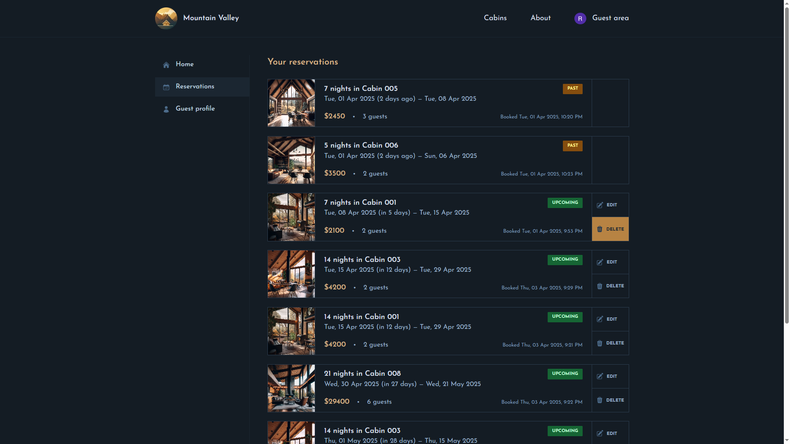
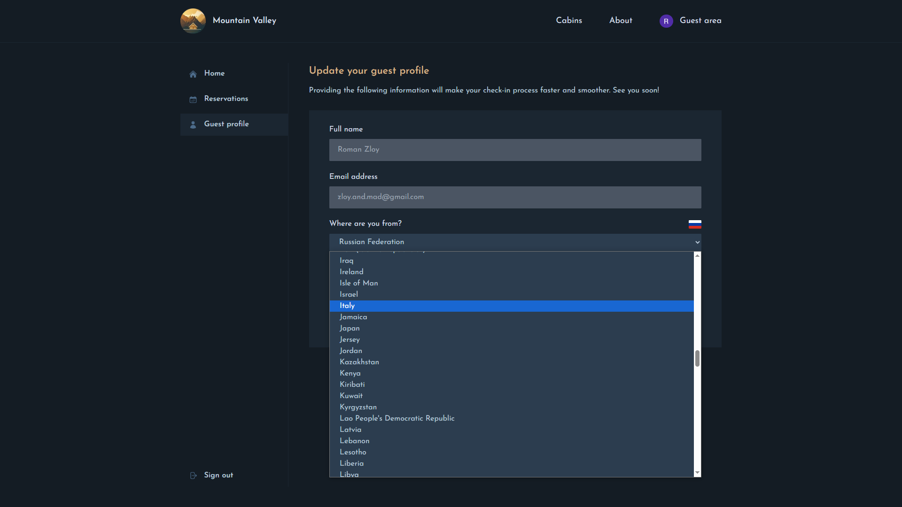
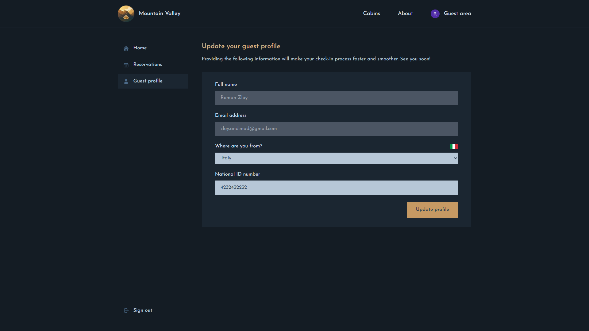
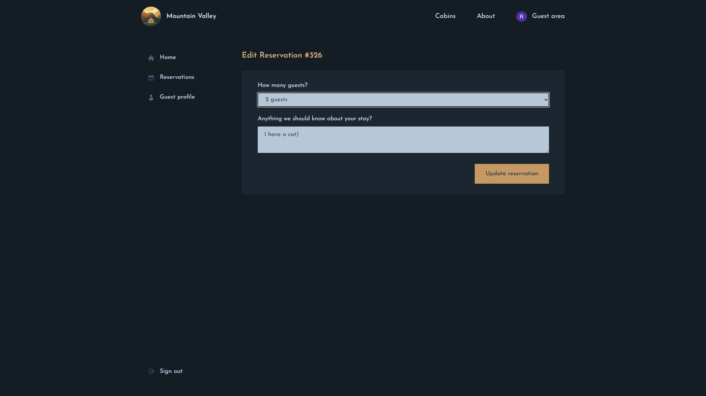

## Tools used:

-   Next.js 14
-   @heroicons/react
-   react-day-picker
-   date-fns
-   Auth.js + Middleware
-   Supabase
-   Tailwind CSS
-   Server Actions (Next.js)
-   useOptimistic Hook

[Link to project](https://mountain-valley-website.vercel.app/)
